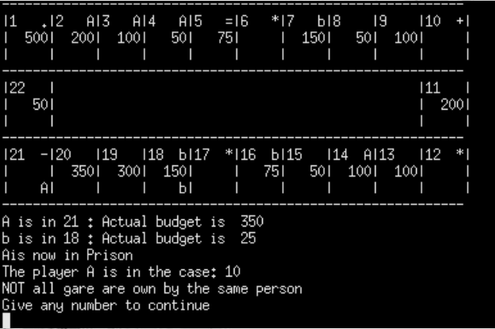
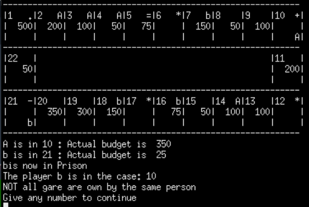

# Statistics and Data Science

Welcome to my GitHub portfolio! I am Andrea Hurtado Quiceno, a PhD candidate at RPTU Kaiserslautern, specializing in Stochastic Analysis and Differential Geometry. Throughout my academic journey, I have engaged in projects ranging from Probability Theory to Statistical Modellisation, including the use of topological data analysis for machine learning. This portfolio serves as a showcase of my research, academic achievements, and projects, reflecting my commitment to pushing the boundaries of knowledge in mathematics and data science.

## Personal Information
- **Email:** 
  - andrea.hurtado.quiceno@gmail.com
  - avanessa.hquiceno@edu.rptu.de
- **LinkedIn:** [Andrea V. Hurtado Quiceno](https://www.linkedin.com/in/andrea-v-hurtado-quiceno-92a834187/)
- **EWM Profile:** [European Women in Mathematics](https://www.europeanwomeninmaths.org/profile/andrea-vanessa-hurtado-quiceno/)
- **Current Affiliation:** PhD Candidate at RPTU Kaiserslautern
  - **Field of Study:** Functional Analysis and Stochastic Analysis
  - **Advisor:** Martin Grothaus

##  Education
- **PhD in Functional Analysis and Stochastic Analysis**  
  RPTU Kaiserslautern (2023 – Present)  

- **Master 2 in Mathematiques Fondamentales**  
  Université Sorbonne (Institut Pierre et Marie Curie), Paris (2020 – 2021)  

- **Master 2 in Mathematical Physics**  
  Université de Bourgogne, Dijon (2019 – 2020)  

- **Master 1 in Mathematical Physics**  
  Université de Bourgogne, Dijon (2018 – 2019)  

- **Master 1 in Modelisation Statistique**  
  Université Franche-Comté, Besançon (2022 – 2023)  

- **BSc in Mathematics**  
  Universidad del Valle, Cali, Colombia (2009 – 2016)  

##  Qualifications
- **Probability Theory:** Passed in March 2024
- **Operator Semigroups:** Passed in September 2024

##  Work Experience
- **Teaching Assistant (Winter Semester 24/25):**  
  Probability Theory at RPTU Kaiserslautern.
  
- **Intern at Inria (Sophia Antipolis):**  
  April 2023 – August 2023

##  Topological Data Analysis

### **Topological Descriptors for Machine Translation and Word Embeddings**  
*Master 1 in Modelisation Statistique master's project*  
Université Franche-Comté, Besançon (2022 – 2023)

This project involved exploring **topological data analysis (TDA)** techniques applied to machine translation and word embeddings. I developed methods to capture topological structures in high-dimensional data spaces, using persistent homology to analyze and compare linguistic datasets. The goal was to improve translation models by integrating topological descriptors, creating more robust and interpretable machine learning models. 

#### **Key Skills and Tools:**
- Topological Data Analysis (TDA)
- Persistent Homology
- Machine Learning Models
- Word Embeddings
- Python.

More detailed information and code for this project will be added soon!

## C++ Project

### **Monopoly Game (Console Game)**  

This project involved creating a console-based version of the popular Monopoly board game using **C++**. The game simulates the traditional Monopoly experience, where players roll dice, purchase properties, and aim to bankrupt their opponents. The game was designed for 2 to 4 players, with each player starting with 500 "polycurrency". Players could upgrade properties, pay rent, and interact with special game elements like the "Policier" box and prison.

#### **Key Features**:
- **Game Initialization**: Players start with 500 polycurrency, and the game board is displayed upon initialization.
- **Turn-based Gameplay**: Players roll a single dice and move around the board. They can upgrade properties or face consequences like going to prison.
- **Property Management**: Players can buy properties, increase their value, and collect rent from opponents.
- **Chance and Policier Boxes**: Includes special boxes for random events (Chance) and sending players to prison (Policier).
- **Game Loop**: The game continues until one player bankrupts all others.

#### **Problem-Solving Approach**:
- **Object-Oriented Design**: Utilized C++ classes such as Case, Joueur, and Plateau to represent game components like players, board spaces, and game rules.
- **Game Logic**: Implemented loops and conditions to control the flow of the game, including player movements, property transactions, and event handling.
- **Console Interface**: Designed the game to run in a console environment, displaying the game board and player actions in real-time.

#### **Key Skills and Tools**:
- Object-Oriented Programming in C++
- Game Loops and Event Handling
- Class Design and Inheritance (Classes: `Case`, `Joueur`, `Plateau`)
- Console-Based User Interface

*Figure 1: Player A arrives to the Police*

*Figure 2: Player A is send to prison*

## Linear Models

### **Linear Models Project (TP1)**  
*Master 1 in Modelisation Statistique master's project*  
Université Franche-Comté, Besançon (2022 – 2023)

This project tackled **simple and multiple linear regression models** to predict apartment prices and body fat percentages using various predictors. The analysis explored the effects of centering, scaling variables, and even creating custom regression functions for better understanding of the data.

#### **Problem-Solving Approach**:
- **Simple Linear Regression**: Predicted apartment prices based on surface area, examining the relationship between the two variables. I explored model performance by comparing residuals, fitted values, and evaluating model adequacy using \( R^2 \). 
- **Regression without Intercept**: I evaluated the impact of removing the intercept in the model, analyzing how the estimates and residuals behaved without it.
- **Centered and Scaled Variables**: Addressed the problem of using raw variables by centering and scaling the data, followed by comparing the resulting regression coefficients with the original models. This allowed me to investigate the effects of scaling on model interpretation.
- **Multiple Linear Regression**: Extended the regression analysis to multiple predictors for body fat percentage, including transformations of weight and height. This analysis provided a more comprehensive view of the relationships between the predictors and the response variable.
- **Custom Regression Function**: I implemented a custom regression function to manually compute coefficients, fitted values, residuals, and \( R^2 \), which I compared with standard R functions. This was a key step in understanding the mechanics behind the linear model.

#### **Key Skills and Tools:**
- Simple and Multiple Linear Regression
- Model Comparison (with and without Intercept)
- Centering and Scaling of Variables
- Custom Regression Functions
- R Programming (Functions: `lm()`, `sweep()`, matrix operations)

[View HTML TP1 report](doc/TP1NEWToSubmit.html)

[View R Document](https://github.com/andrea072693/Andrea_Vanessa_Hurtado_Quiceno_DataLab.github.io/blob/04fb0a05ed8fa8fbcd9016e949ab3820056e0c81/doc/TP1NEWToSubmit.Rmd)

### **Linear Models Project (TP2)**  

This project involved using multiple **linear regression models** to predict ozone concentration based on meteorological data. The dataset included variables like temperature, cloud cover, wind speed, and ozone concentration from the previous day. The goal was to answer several key statistical questions, such as model adequacy, confidence interval estimation, and bias detection.

#### **Key Questions Solved:**
- **Model Comparison**: Comparing a simple model (M1) using temperature at noon (T12) as a predictor with a more complex model (M2) that included additional variables (Vx, cloud cover at noon (Ne12), and the previous day's maximum ozone level).
- **Model Adequacy**: Evaluating whether the simple and multiple models provide a good fit, and whether the predictor variables significantly explain the ozone concentration.
- **Confidence Intervals**: Calculating confidence intervals for each regression coefficient, and visualizing these using confidence ellipses.
- **Unbiasedness of Estimators**: Conducting simulations to verify that the estimators for the coefficients are unbiased by drawing 10,000 random samples from the dataset.
- **Bootstrap Confidence Intervals**: Applying the bootstrap method to estimate confidence intervals when the sample size is small and normality assumptions may not hold.

#### **Key Skills and Tools:**
- Multiple Linear Regression
- Confidence Interval Estimation and Ellipses
- Bias Detection in Estimators
- Bootstrap Methods for Confidence Intervals
- R Programming (Libraries: `lm()`, `ellipse`, `bootstrap`)

[View HTML TP2 report](TP2/TP2NEW2.html)

[View R Document](https://github.com/andrea072693/Andrea_Vanessa_Hurtado_Quiceno_DataLab.github.io/blob/04fb0a05ed8fa8fbcd9016e949ab3820056e0c81/TP2/TP2NEW2.Rmd)

### **Linear Models Project (TP3)**  

This project focused on building and validating multiple **linear regression models** using the Ozone dataset. The primary goal was to predict maximum daily ozone concentration based on environmental variables such as temperature, cloud cover, wind speed, and ozone concentration from the previous day. I explored model assumptions, detected influential points, and applied model selection techniques, including AIC, BIC, and cross-validation, to choose the best performing model.

#### **Key Skills and Tools:**
- Multiple Linear Regression
- Residual Diagnostics and Validation
- Model Selection (AIC, BIC, Adjusted \( R^2 \))
- Cross-Validation Techniques
- R Programming (Libraries: `lm()`, `corrplot`, `leaps`)

[View HTML TP3 report](TP3/TP3HURTADOAndrea.html)

## Data Analysis Lecture

### Socioeconomic Differences Between Bourgogne and Franche-Comté Regions in 2012: A PCA Analysis

#### **PCA Analysis Project**  

This project focused on analyzing **socioeconomic disparities** between Bourgogne and Franche-Comté using data from the 2012 national French census. Principal Component Analysis (PCA) was used to investigate relationships between demographic, employment, education, and housing variables across the two regions.

##### **Problem-Solving Approach**:
- **PCA on 18 Variables**:  
  Conducted PCA on variables related to:
  - Gender (male/female)
  - Education (diploma/no diploma)
  - Employment (unemployed, agriculture, managers, manual workers)
  - Housing (ownership, rent, HLM, house/apartment, secondary residence)
  - Age Groups (15-29, 30-74, 75+)

- **Mapping and Visualizations**:  
  Used the following R packages to create detailed visualizations:
  - `sf`
  - `tmap`
  - `leaflet`
  - `gridExtra`
  - `ggrepel`
  
  Generated maps to visualize population distribution, employment, housing status, and education levels across Bourgogne and Franche-Comté.

- **Clustering Analysis**:  
  Applied clustering and dendrograms to group communes based on socioeconomic factors, highlighting differences such as:
  - More homeownership in Bourgogne.
  - More renting and unemployment in Franche-Comté.

- **Key Findings**:  
  - Manual workers are closely correlated with not having a diploma.
  - Unemployed individuals are more likely to live in HLM housing and rent homes.
  - Homeownership is more prevalent among people aged 30-74 in Bourgogne.
  - Executives are more common in Bourgogne, while renting is more common in Franche-Comté.
  - Women are more likely to be in executive jobs in Franche-Comté than in Bourgogne.

##### **Key Tools**:
- **Principal Component Analysis (PCA)** for dimensionality reduction and correlation analysis.
- **Clustering and Dendrogram Analysis** for identifying group patterns.
- **R packages for mapping and visualization**:
  - `sf`, `tmap`, `leaflet`, `gridExtra`, `ggrepel`

[View HTML Data Analisis project](project/Projet_Ritish_Andrea.html)

[View R Document](https://github.com/andrea072693/Andrea_Vanessa_Hurtado_Quiceno_DataLab.github.io/blob/04fb0a05ed8fa8fbcd9016e949ab3820056e0c81/project/Projet_Ritish_Andrea.rmd)

##### **Recommendations for Further Study**:
A deeper analysis of communes in both regions, potentially including additional variables like salary, tax payments, and financial background to better understand economic conditions.

### Singular Value Decomposition (SVD) for Image Reconstruction

This project demonstrates the application of Singular Value Decomposition (SVD) for image compression and reconstruction. Using a grayscale image of Montmartre, we employed SVD to reduce the image's dimensionality while preserving its essential features.

### **Objectives:**
- Use SVD to decompose a matrix representation of an image into its singular values.
- Reconstruct the image using different numbers of singular values to achieve compression.
- Evaluate the compression quality using metrics such as **Mean Square Error (MSE)** and **Peak Signal-to-Noise Ratio (PSNR)**.

#### **Key Findings:**
- Compressing the image by retaining fewer singular values still maintains high image quality.
- **Standardizing** the image matrix before SVD results in better reconstruction quality, with a higher PSNR and a smaller MSE.
- **Computational Time**: SVD is computationally efficient even for large image matrices.

#### **Tools Used:**
- R Libraries:
  - `png` for reading the image.
  - `BBmisc` for normalizing the matrix.
  - `stats` for performing the SVD.
  - `gridExtra` for visualizing results.
 
[View PDF Document](https://github.com/andrea072693/Andrea_Vanessa_Hurtado_Quiceno_DataLab.github.io/blob/cdc421bf68f624c751fd21253e8f22164da6d0ca/SVD/SVD_Project__Ritish__Andrea.pdf)

## Simulation in R 

This project simulates the random walk of a turtle on a 2D grid using Monte Carlo methods. The goal is to estimate the distribution of the number of revisits (\(N_n\)) to previously visited points for different step sizes \(n = 100\), \(n = 1000\), and \(n = 10000\).

### **Authors**:
- A.V Hurtado Quiceno
- Narain Ritish

### **Problem Description**
The turtle starts at the origin \((0,0)\) and moves randomly in one of four directions: \((0,1)\), \((1,0)\), \((0,-1)\), or \((-1,0)\). After each step, we record whether the turtle revisits a previously visited point.

For each value of \(n\), we calculate \(N_n\), the number of revisits, and use Monte Carlo simulations to analyze the distribution of \(N_n\).

#### **Steps**:
1. Simulate the random walk for different values of \(n\).
2. Use Monte Carlo methods to estimate the distribution of revisits.
3. Visualize the results using histograms and plots.

#### **Key Aspects**
- **Objective**: To estimate the distribution of revisit events using Monte Carlo simulations.
- **Simulation**: Conducted for \(n = 100\), \(n = 1000\), and \(n = 10000\) steps.
- **Monte Carlo Methods**: Used to run multiple simulations to generate a graphical representation of \(N_n\).
- **Graphical Analysis**: Histograms and density plots were used to understand the distribution of revisit events.

#### **R Packages Used**
- `ggplot2`: For creating visualizations such as histograms and density plots.
- `dplyr`: For data manipulation and summarization.
- `purrr`: For mapping functions and running multiple simulations efficiently.
- `tidyr`: To organize and reshape the simulation data.
- `tibble`: For creating and managing tidy data frames.
- `gridExtra`: For arranging multiple plots in a grid format for easier comparison.

[View HTML Simulations](simulations/SimulationProject_Ritish_Andrea.html)

[View R code](https://github.com/andrea072693/Andrea_Vanessa_Hurtado_Quiceno_DataLab.github.io/blob/cdc421bf68f624c751fd21253e8f22164da6d0ca/simulations/SimulationProject_Ritish_Andrea.Rmd)

## Statistics Lecture

This project analyzes simulated data using statistical methods. The goal is to explore various aspects of the data, perform hypothesis testing, and build regression models to understand the underlying relationships.

#### **Key Aspects**:  
- **Data Simulation**: Generated synthetic data to represent real-world scenarios.
- **Hypothesis Testing**: Applied t-tests and chi-squared tests to validate hypotheses about the data.
- **Regression Modeling**: Built linear regression models to predict outcomes and understand variable dependencies.
  
#### **R Packages Used**:  
- `ggplot2`: For data visualization.
- `dplyr`: For data manipulation.
- `car`: For regression diagnostics and hypothesis testing.
- `tidyr`: For reshaping and organizing data.
  
[View HTML Statistics](statistics/project_statististics.html)

[View R code](https://github.com/andrea072693/Andrea_Vanessa_Hurtado_Quiceno_DataLab.github.io/blob/5195913c2c25880daf861448d59a8d2539baf68c/statistics/project_statististics.Rmd)

## New projects, coming soon!
